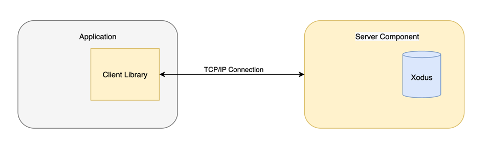

# Xodus Remote Entity Store

# Server

Xodus entity sore service can be started via docker:
```
docker run -p 9042:9042 -v xodus-data:/var/opt/xodus -e XRES_DIR=/var/opt/xodus  zumaxim/xres:latest
```

ENV variables:
- `XRES_PORT` - the Xodus Server port (9042 by default)
- `XRES_DIR` - the directory to store xodus data 

# Client

Xodus Client JVM library provides an API to connect to Xodus Remote Entity Store and work with the storage 
The dependency is available as [GitHub Package](https://github.com/zmaks/xodus-remote-entity-store/packages)

**Gradle:**
```
implementation 'com.zheltoukhov.xres:client:1.0.0'
```

**Maven:**
```xml
<dependency>
  <groupId>com.zheltoukhov.xres</groupId>
  <artifactId>client</artifactId>
  <version>1.0.0</version>
</dependency>
```

Check the latest version in the [releases section](https://github.com/zmaks/xodus-remote-entity-store/releases).

## Example

```kotlin
val tx = entityStore.beginTransaction()

val entity1 = tx.create(EntityDto(type = "CRUD", properties = mapOf("foo" to "bar")))
val entity2 = tx.create(EntityDto(type = "CRUD", properties = mapOf("two" to 2)))

val updatedEntity2 = tx.update(
    EntityDto(entity2.id, "CRUD", entity2.properties + mapOf("some" to "new"))
)

tx.delete(entity2.id!!)

val entitiesPage = tx.find(FilterDto("CRUD"))

entitiesPage.content.size
entitiesPage.content.first().id

tx.get(entity1.id!!).id

tx.commit()
```

---

# Proposal

This part describes the design and description of the remote entity storage MVP.

**Authors:** Maksim Zheltoukhov  
**Status:** _Implemented_

## Abstract

Xodus Remote Entity Store is an entity storage based on Xodus DB and written in Kotlin. 
Consist of a **server** component and a **client library** to work with the server.
Allows to store simple entities and manage them **transactionally** by multiple clients.

## Server Component

- Uses [Xodus](https://github.com/JetBrains/xodus) embedded database to store the entities
- Stores simple entities that can contain only string, number or boolean properties
- Supports transactions
- Communicates with clients over TCP/IP
- Supports multiple clients

## Client Library

- Provides CRUD API to manage entities
- Supports transactions (keeps snapshot isolation level)
- Communicates with the server over TCP/IP

## Implementation Details

This part briefly describes how the remote entity store is implemented.


The server has an instance of [Xodus persistent entity store](https://github.com/JetBrains/xodus#entity-stores) 
as a storage of entities. The server runs on a specific host and has a socket that's bound to a specific port provided 
in the server config. When server accepts a connection from a client, it parses the commands and passes them to API layer
which interacts with the Xodus store. The API layer provides methods to add, modify, delete, get, list entities.
Transactions are stored in memory in order to be used by several connections by transaction id, so no need to keep
one TCP connection for whole transaction. The transaction is committed only after the commit command is received,
otherwise all the commands are rolled back.

The client is a library that can be added to any JVM application to connect to the remote entity store. The library
provides a connection abstraction which allows to create a client socket to initiate communication with the server 
by provided host and port. It is possible to create more than one connection simultaneously. The library provides 
commands to add, modify, delete, get, list entities that are stored on the server. The client connection runs a transaction
on the server that can be committed or rolled back via specific commands provided by the library as well as the CRUD commands.

### TCP/IP Socket Interaction (Ktor Sockets)

As it was mentioned above, the communication between client and server is provided via TCP/IP socket connection.
The storage server and the library uses **[Ktor Sockets](https://ktor.io/docs/servers-raw-sockets.html)** dependency as a
mechanism to establish such a communication.

The reasons of using Ktor:
- Ready and reliable solution for TCP sockets
- Written in Kotlin
- Save time in implementation of the solution 
- Interest in learning the framework
---

## Out of MVP Scope (Future Plans)

1. [Security] Add client basic authorization (username/password)
2. [Security] Add Secure Sockets (TLS) support
3. [Connection] Add client connection pool support
4. [ORM] Add ORM support to the client lib
5. Improve entity search/filtering
6. Support readonly and exclusive transactions
7. Improve error handling


